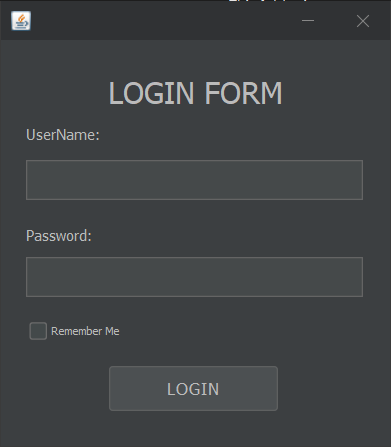
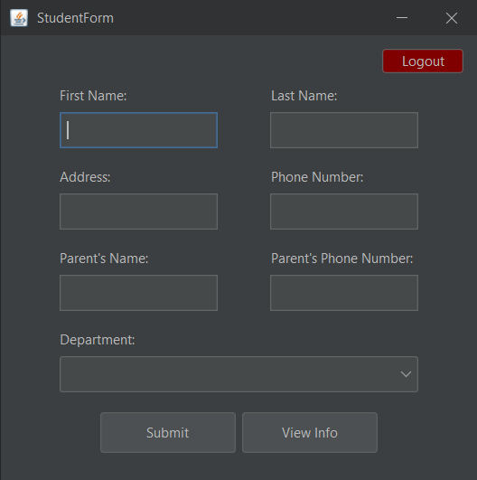
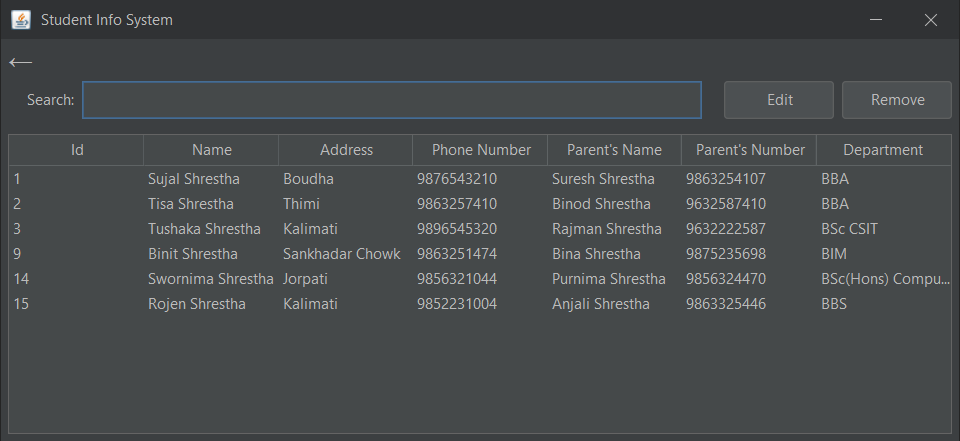

# Student Information System
Student information system is a simple system which is used to register, edit, remove and view student details using jdbc and java swing. 

## Screenshots

- Login page

    

- Register page

    

- View Student Details page

    

## Prerequisite

- Java 8 or higher
- FlatLaf [Download here](https://www.formdev.com/flatlaf/)
- Apache NetBeans and Xampp

